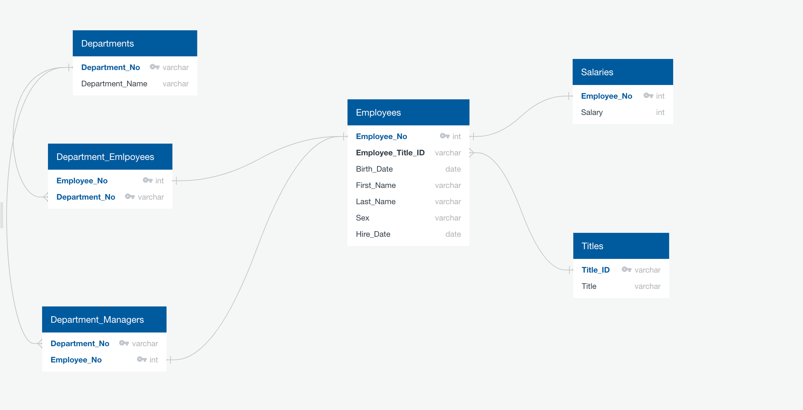

# Employee Database: Research project using SQL.

## Instructions

#### Data Modeling

In the first part, CSVs were inspected and ERD of the tables were sketched out using tool [http://www.quickdatabasediagrams.com](http://www.quickdatabasediagrams.com).
[

#### Data Engineering

* Table schemas created for each of the six CSV files. Data types, primary keys, foreign keys specified.

* Each CSV files were imported into the corresponding SQL table. 

#### Data Analysis

Following details were listed: 

1. Employee number, last name, first name, sex, and salary of each employee.

2. First name, last name, and hire date for employees who were hired in 1986.

3. The manager of each department with the following information: department number, department name, the manager's employee number, last name, first name.

4. The department of each employee with the following information: employee number, last name, first name, and department name.

5. First name, last name, and sex for employees whose first name is "Hercules" and last names begin with "B."

6. All employees in the Sales department, including their employee number, last name, first name, and department name.

7. All employees in the Sales and Development departments, including their employee number, last name, first name, and department name.

8. In descending order, the frequency count of employee last names, i.e., how many employees share each last name.